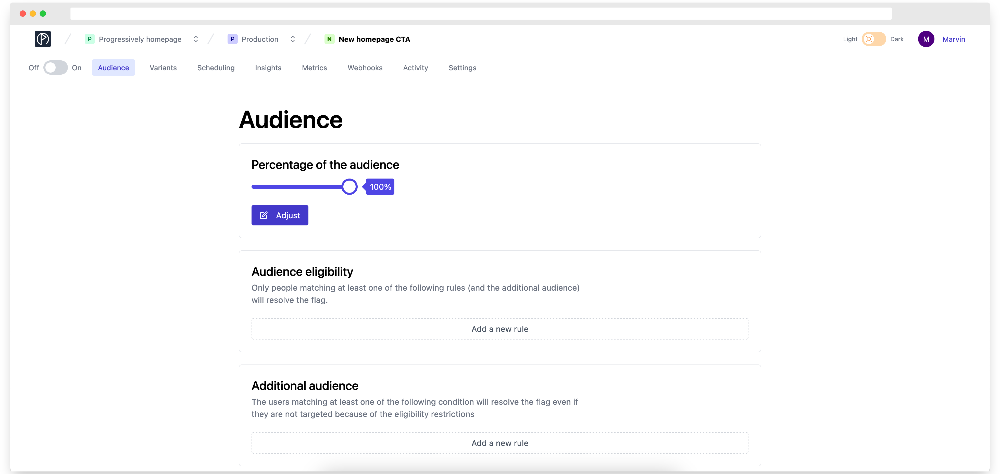
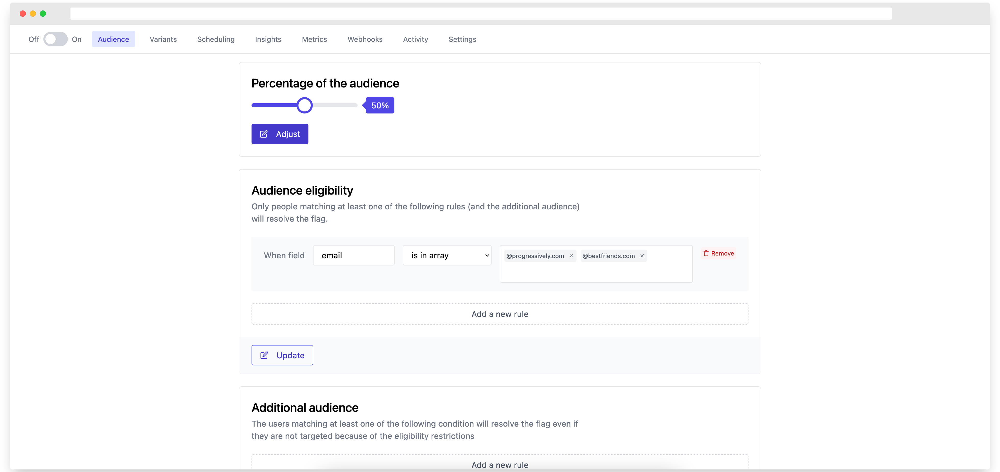

# Feature flag targeting

Progressively comes with two main ways to target the users that are supposed to receive a specific variant of your feature flags: The **quantitative way** and the **qualitative way** (they are not exclusive).


Any of the **quantitive** or **qualitative** rules will only apply if the feature toggle is **activated**. If it's not activated, every single user will receive the `false` variation of your flags.


### The quantitative way (Percentage of the audience)

After a feature flag creation, you can decide which percentage of your audience should receive the `true` variation of your feature flag using the slider in the **"Audience"** pane:ge

<figure><figcaption></figcaption></figure>

### The qualitative way (Audience eligibility)

You can also choose to add additional eligibility constraints.

For example, it's possible to create rules that will allow **50%** of the users that match the following two rules to see the `true` variant of the flag:

* People with an **email containing @progressively.app**
* People with an **email containing @bestfriends.com**

<figure><figcaption></figcaption></figure>

### The joker audience (Additional audience)

There is a last way to target a specific set of users. I tend to call these users "Joker Users". Let me illustrate this with an example.

Imagine that you are building a very new fancy feature that you are about to roll out. But you lack confidence, and you want to roll it out slowly. Let's say 10% of your audience for starting.

Now you may wonder:

> _I want to be part of these 10% people so that I can play with my team with this new feature"_

With the **Eligibility Audience** rules, it's not possible, since they aim to add another level of filtering, not a level of opening.

**Additional audience** aims to handle this particular case: people matching at least one of the rules are not subject to the percentage rollout and will receive the configured flag variation.

**It's a more permissive set of rules that bypasses any qualitative or quantitative rules.**
