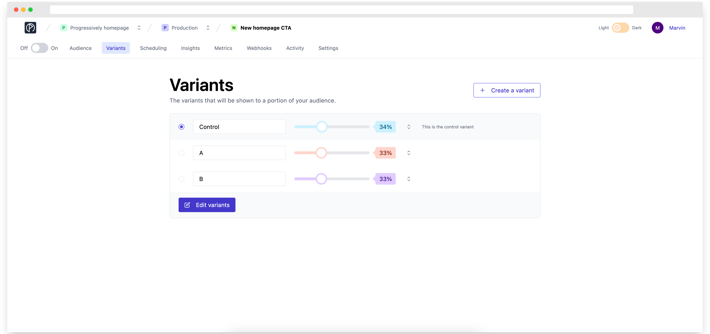

# Feature flag variants

### Single variant

By default, when a feature flag is created in the dashboard and used by an application, the underlying SDK used by this application will provide a boolean value.

For example, you may have created a new fancy UI for your login page, and you want to show it to only 10% of your audience. Using Progressively, inside your application codebase you will do something like:

```jsx
if (flags.showNewLoginPage) {
  return "This is the new homepage!";
}

return "This is the old homepage :(";
```

In this situation, `flags.showNewLoginPage` can only have two values `true` or `false`: It's called a **Single variant feature flag**.

### Multi variant

With progressively, you can also use **Multi variant feature flags**. They are flags that can have other values than `true` or `false`. In order to do so, you have to create different `Variants` at the feature flag level and associate them with a certain percentage.

<figure><figcaption></figcaption></figure>

For example, getting back to the new login page you may have created 2 new fancy UIs for your login page, and you want to show them respectively to 10% of your audience. Using Progressively, inside your application codebase you will do something like:

```jsx
if (flags.showNewLoginPage === "Variant B") {
  return "This is the new homepage B!";
}

if (flags.showNewLoginPage === "Variant C") {
  return "This is the new homepage C!";
}

return "This is the old homepage, control variant";
```

Something important to understand: if you show the new login page to 20% (Variant B + Variant C) of your audience, what happens to the 80% remaining?

In Progressively, the remaining percentage will be evaluated as the **Control variant**. In other words, if Progressively does not manage to resolve a variant for a given user, it will provide them back with the **Control variant**.
