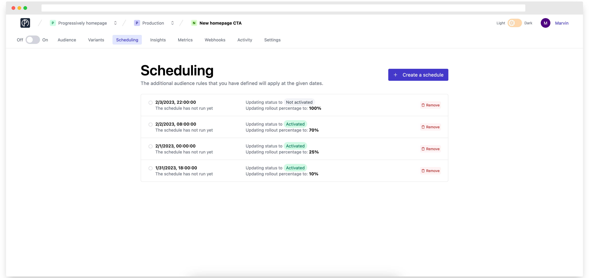

# Scheduling a feature flag update

With Progressively, you define the future state of your feature flags.&#x20;

> In a company I used to work with, we funnily called this feature _"Future flags",_ which makes a lot of sense.

<figure><figcaption></figcaption></figure>

For example, it's possible to define the following states directly inside the dashbaord:

* Switching **ON** the `newLoginPage` feature flag on **Monday** next week at **10am** for **10%** of the audience
* Switching **ON** the `newLoginPage` feature flag on **Tuesday** next week at **9am** for **20%** of the audience
* Switching **ON** the `newLoginPage` feature flag on **Wednesday** next week at **6am** for **50%** of the audience
* Switching **OFF** the `newLoginPage` feature flag on **Friday** next week at **5pm**
